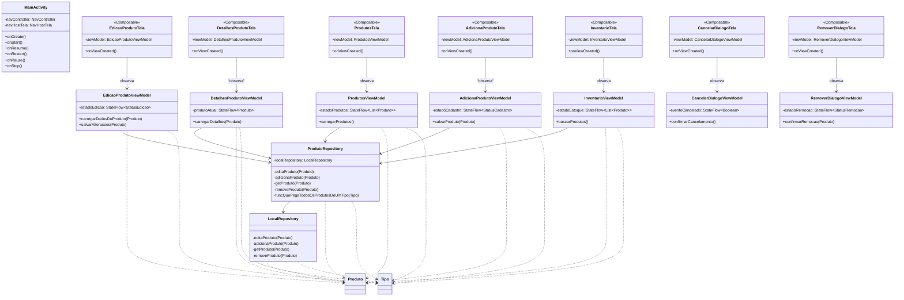

```mermaid
classDiagram

class MainActivity{
    -navController: NavController
    -navHostTela: NavHostTela
    +onCreate()
    +onStart()
    +onResume()
    +onRestart()
    +onPause()
    +onStop()
}

class InventarioTela{
    <<Composable>>
    -viewModel: InventarioViewModel
    +onViewCreated()
}

class InventarioViewModel{
    -estadoEstoque: StateFlow~List~Produto~~
    +buscarProdutos()
}
InventarioTela --> InventarioViewModel : observa

class AdicionaProdutoTela{
    <<Composable>>
    -viewModel: AdicionaProdutoViewModel
    +onViewCreated()
}

class AdicionaProdutoViewModel{
    -estadoCadastro: StateFlow~StatusCadastro~
    +salvarProduto(Produto)
}
AdicionaProdutoTela --> AdicionaProdutoViewModel : "observa"

class ProdutosTela{
    <<Composable>>
    -viewModel: ProdutosViewModel
    +onViewCreated()
}

class ProdutosViewModel{
    -estadoProdutos: StateFlow~List~Produto~~
    +carregarProdutos()
}
ProdutosTela --> ProdutosViewModel : observa

class DetalhesProdutoTela{
    <<Composable>>
    -viewModel: DetalhesProdutoViewModel
    +onViewCreated()
}

class DetalhesProdutoViewModel{
    -produtoAtual: StateFlow~Produto~
    +carregarDetalhes(Produto)
}
DetalhesProdutoTela --> DetalhesProdutoViewModel : "observa"

class EdicaoProdutoTela{
    <<Composable>>
    -viewModel: EdicaoProdutoViewModel
    +onViewCreated()
}

class EdicaoProdutoViewModel{
    -estadoEdicao: StateFlow~StatusEdicao~
    +carregarDadosDoProduto(Produto)
    +salvarAlteracoes(Produto)
}
EdicaoProdutoTela --> EdicaoProdutoViewModel : observa

class CancelarDialogoTela{
    <<Composable>>
    -viewModel: CancelarDialogoViewModel
    +onViewCreated()
}

class CancelarDialogoViewModel{
    -eventoCancelado: StateFlow~Boolean~
    +confirmarCancelamento()
}
CancelarDialogoTela --> CancelarDialogoViewModel : observa

class RemoverDialogoTela{
    <<Composable>>
    -viewModel: RemoverDialogoViewModel
    +onViewCreated()
}

class RemoverDialogoViewModel{
    -estadoRemocao: StateFlow~StatusRemocao~
    +confirmarRemocao(Produto)
}
RemoverDialogoTela --> RemoverDialogoViewModel : observa


class ProdutoRepository{
    -localRepository: LocalRepository
    -editaProduto(Produto)
    -adicionaProduto(Produto)
    -getProduto(Produto)
    -removeProduto(Produto)
    -funcQuePegaTodosOsProdutosDeUmTipo(Tipo)
}

class LocalRepository{
    -editaProduto(Produto)
    -adicionaProduto(Produto)
    -getProduto(Produto)
    -removeProduto(Produto)
}

ProdutoRepository --> LocalRepository
EdicaoProdutoViewModel --> ProdutoRepository
DetalhesProdutoViewModel --> ProdutoRepository
ProdutosViewModel --> ProdutoRepository
AdicionaProdutoViewModel--> ProdutoRepository
InventarioViewModel --> ProdutoRepository

class Produto {}

class Tipo{}

ProdutoRepository ..> Produto
LocalRepository ..> Produto
EdicaoProdutoViewModel ..> Produto
DetalhesProdutoViewModel ..> Produto
ProdutosViewModel ..> Produto
AdicionaProdutoViewModel ..> Produto
InventarioViewModel ..> Produto
ProdutoRepository ..> Tipo
LocalRepository ..> Tipo
EdicaoProdutoViewModel ..> Tipo
DetalhesProdutoViewModel ..> Tipo
ProdutosViewModel ..> Tipo
AdicionaProdutoViewModel ..> Tipo
InventarioViewModel ..> Tipo

```