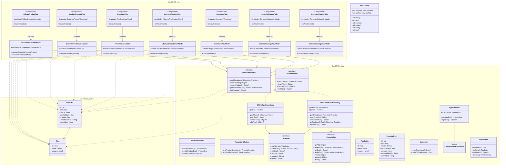

```mermaid
classDiagram

class MainActivity{
    -navController: NavController
    -navHostTela: NavHostTela
    +onCreate()
    +onStart()
    +onResume()
    +onRestart()
    +onPause()
    +onStop()
}

namespace CusCRUD_front{
  class InventarioTela{
    <<Composable>>
    -viewModel: InventarioViewModel
    +onViewCreated()
}

class InventarioViewModel{
    -estadoEstoque: StateFlow~List~Produto~~
    +buscarProdutos()
}

class AdicionaProdutoTela{
    <<Composable>>
    -viewModel: AdicionaProdutoViewModel
    +onViewCreated()
}

class AdicionaProdutoViewModel{
    -estadoCadastro: StateFlow~StatusCadastro~
    +salvarProduto(Produto)
}

class ProdutosTela{
    <<Composable>>
    -viewModel: ProdutosViewModel
    +onViewCreated()
}

class ProdutosViewModel{
    -estadoProdutos: StateFlow~List~Produto~~
    +carregarProdutos()
}

class DetalhesProdutoTela{
    <<Composable>>
    -viewModel: DetalhesProdutoViewModel
    +onViewCreated()
}

class DetalhesProdutoViewModel{
    -produtoAtual: StateFlow~Produto~
    +carregarDetalhes(Produto)
}

class EdicaoProdutoTela{
    <<Composable>>
    -viewModel: EdicaoProdutoViewModel
    +onViewCreated()
}

class EdicaoProdutoViewModel{
    -estadoEdicao: StateFlow~StatusEdicao~
    +carregarDadosDoProduto(Produto)
    +salvarAlteracoes(Produto)
}

class CancelarDialogoTela{
    <<Composable>>
    -viewModel: CancelarDialogoViewModel
    +onViewCreated()
}

class CancelarDialogoViewModel{
    -eventoCancelado: StateFlow~Boolean~
    +confirmarCancelamento()
}

class RemoverDialogoTela{
    <<Composable>>
    -viewModel: RemoverDialogoViewModel
    +onViewCreated()
}

class RemoverDialogoViewModel{
    -estadoRemocao: StateFlow~StatusRemocao~
    +confirmarRemocao(Produto)
}
}

AdicionaProdutoTela --> AdicionaProdutoViewModel : "observa"
ProdutosTela --> ProdutosViewModel : "observa"
EdicaoProdutoTela --> EdicaoProdutoViewModel : "observa"
DetalhesProdutoTela --> DetalhesProdutoViewModel : "observa"
CancelarDialogoTela --> CancelarDialogoViewModel : "observa"
InventarioTela --> InventarioViewModel : "observa"
RemoverDialogoTela --> RemoverDialogoViewModel : "observa"

EdicaoProdutoViewModel --> ProdutoRepository
DetalhesProdutoViewModel --> ProdutoRepository
ProdutosViewModel --> ProdutoRepository
AdicionaProdutoViewModel--> ProdutoRepository
InventarioViewModel --> ProdutoRepository
ProdutoRepository ..> Produto
EdicaoProdutoViewModel ..> Produto
DetalhesProdutoViewModel ..> Produto
ProdutosViewModel ..> Produto
AdicionaProdutoViewModel ..> Produto
InventarioViewModel ..> Produto
ProdutoRepository ..> Tipo
EdicaoProdutoViewModel ..> Tipo
DetalhesProdutoViewModel ..> Tipo
ProdutosViewModel ..> Tipo
AdicionaProdutoViewModel ..> Tipo
InventarioViewModel ..> Tipo

  namespace CusCRUD_data {
    class DatabaseModule {
      + provideDatabase() AppDatabase
      + provideProdutoDao() ProdutoDao
      + provideTipoDao() TipoDao
    }
    class RepositoryModule {
      + bindProdutoRepository() ProdutoRepository
      + bindTipoRepository() TipoRepository
    }
    class TipoDao {
      <<interface>>
      + getAll() List~TipoEntity~
      + getAllFlow() Flow~List~TipoEntity~~
      + getById() Object?
      + insert() Object
      + update() Object
      + delete() Object
    }
    class ProdutoDao {
      <<interface>>
      + getAll() Object
      + getAllFlow() Flow~List~ProdutoEntity~~
      + getById() Object?
      + getByTipo() Flow~List~ProdutoEntity~~
      + insert() Object
      + update() Object
      + delete() Object
    }
    class TipoEntity {
      - id : long
      - nome : String
      - imagem : byte[]
    }
    class ProdutoEntity {
      - id : int
      - tipo : long
      - marca : String
      - dataValidade : long
      - unidade : long
      - unidadeMedida : String
      - quantidade : long
    }
    class Converters {
      + fromTimestamp() Date?
      + dateToTimestamp() Long?
    }
    class AppDatabase_Companion["AppDatabase.Companion"] {
      <<inner>>
    }
    class AppDatabase {
      + Companion : Companion
      + produtoDao() ProdutoDao
      + tipoDao() TipoDao
    }
    class MappersKt {
      + toDomain() Tipo
      + toEntity() TipoEntity
      + toDomain() Produto
      + toEntity() ProdutoEntity
    }
    class OfflineTipoRepository {
      - tipoDao : TipoDao
      + getAllTipos() Flow~List~Tipo~~
      + insertTipo() Object
      + removeTipo() Object?
      + editTipo() Object?
    }
    class OfflineProdutoRepository {
      - produtoDao : ProdutoDao
      - tipoDao : TipoDao
      + getAllProdutos() Flow~List~Produto~~
      + insertProduto() Object
      + removeProduto() Object?
      + getProdutosByTipo() Flow~List~Produto~~
      + editProduto() Object?
    }
  
    class TipoRepository {
      <<interface>>
      + getAllTipos() Flow~List~Tipo~~
      + insertTipo() Object
      + removeTipo() Object?
      + editTipo() Object?
    }
    class ProdutoRepository {
      <<interface>>
      + getAllProdutos() Flow~List~Produto~~
      + insertProduto() Object
      + removeProduto() Object?
      + getProdutosByTipo() Flow~List~Produto~~
      + editProduto() Object?
    }
    
  }

  namespace CusCRUD_entities{
    class Tipo {
      - id : long
      - nome : String
      - imagem : byte[]
    }
    class Produto {
      - id : int
      - tipo : Tipo
      - marca : String
      - dataValidade : Date
      - unidade : long
      - unidadeMedida : String
      - quantidade : long
    }
  }
    
AppDatabase .. AppDatabase_Companion
TipoRepository <|.. OfflineTipoRepository
OfflineTipoRepository --> TipoDao
ProdutoRepository <|.. OfflineProdutoRepository
OfflineProdutoRepository --> ProdutoDao
OfflineProdutoRepository --> TipoDao
Produto --> Tipo


```