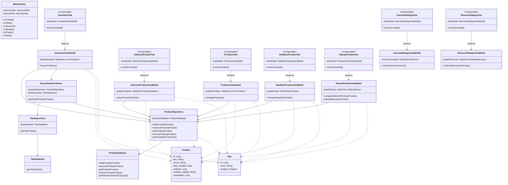

```mermaid
classDiagram

class MainActivity{
    -navController: NavController
    -navHostTela: NavHostTela
    +onCreate()
    +onStart()
    +onResume()
    +onRestart()
    +onPause()
    +onStop()
}

class InventarioTela{
    <<Composable>>
    -viewModel: InventarioViewModel
    +onViewCreated()
}

class InventarioViewModel{
    -estadoEstoque: StateFlow~List~Produto~~
    +buscarProdutos()
}
InventarioTela --> InventarioViewModel : observa

class AdicionaProdutoTela{
    <<Composable>>
    -viewModel: AdicionaProdutoViewModel
    +onViewCreated()
}

class AdicionaProdutoViewModel{
    -estadoCadastro: StateFlow~StatusCadastro~
    +salvarProduto(Produto)
}
AdicionaProdutoTela --> AdicionaProdutoViewModel : "observa"

class ProdutosTela{
    <<Composable>>
    -viewModel: ProdutosViewModel
    +onViewCreated()
}

class ProdutosViewModel{
    -estadoProdutos: StateFlow~List~Produto~~
    +carregarProdutos()
}
ProdutosTela --> ProdutosViewModel : observa

class DetalhesProdutoTela{
    <<Composable>>
    -viewModel: DetalhesProdutoViewModel
    +onViewCreated()
}

class DetalhesProdutoViewModel{
    -produtoAtual: StateFlow~Produto~
    +carregarDetalhes(Produto)
}
DetalhesProdutoTela --> DetalhesProdutoViewModel : "observa"

class EdicaoProdutoTela{
    <<Composable>>
    -viewModel: EdicaoProdutoViewModel
    +onViewCreated()
}

class EdicaoProdutoViewModel{
    -estadoEdicao: StateFlow~StatusEdicao~
    +carregarDadosDoProduto(Produto)
    +salvarAlteracoes(Produto)
}
EdicaoProdutoTela --> EdicaoProdutoViewModel : observa

class CancelarDialogoTela{
    <<Composable>>
    -viewModel: CancelarDialogoViewModel
    +onViewCreated()
}

class CancelarDialogoViewModel{
    -eventoCancelado: StateFlow~Boolean~
    +confirmarCancelamento()
}
CancelarDialogoTela --> CancelarDialogoViewModel : observa

class RemoverDialogoTela{
    <<Composable>>
    -viewModel: RemoverDialogoViewModel
    +onViewCreated()
}

class RemoverDialogoViewModel{
    -estadoRemocao: StateFlow~StatusRemocao~
    +confirmarRemocao(Produto)
}
RemoverDialogoTela --> RemoverDialogoViewModel : observa


class ProdutoRepository{
    -produtoDatabase: ProdutoDatabase
    +editaProduto(Produto)
    +adicionaProduto(Produto)
    +getProduto(Produto)
    +removeProduto(Produto)
    +getProdutosDoTipo(Tipo)
}

class ProdutoDatabase{
    +editaProduto(Produto)
    +adicionaProduto(Produto)
    +getProduto(Produto)
    +removeProduto(Produto)
    +getTodosProdutosDoTipo(Tipo)
}

ProdutoRepository --> ProdutoDatabase
EdicaoProdutoViewModel --> ProdutoRepository
DetalhesProdutoViewModel --> ProdutoRepository
ProdutosViewModel --> ProdutoRepository
AdicionaProdutoViewModel--> ProdutoRepository
InventarioViewModel --> ProdutoRepository

class BuscaTodosProdutos{
    -produtoRepository: ProdutoRepository
    -tipoRepository: TipoRepository
    +getTodosProdutosETipos()
}

class TipoRepository{
    -tipoDatabase: TipoDatabase
    +getTodosTipos()
}

class TipoDatabase{
    +getTodosTipos()
}

BuscaTodosProdutos --> TipoRepository
BuscaTodosProdutos --> ProdutoRepository
InventarioViewModel --> BuscaTodosProdutos
TipoRepository --> TipoDatabase

class Produto {
    -id: Long
    -tipo: String
    -marca: String
    -data_validade: Date
    -unidade: Long
    -unidade_medida: String
    -quantidade: Long
}

class Tipo{
    -id: Long
    -nome: String
    -imagem: Imagem
}

ProdutoRepository ..> Produto
EdicaoProdutoViewModel ..> Produto
DetalhesProdutoViewModel ..> Produto
ProdutosViewModel ..> Produto
AdicionaProdutoViewModel ..> Produto
InventarioViewModel ..> Produto
ProdutoRepository ..> Tipo
EdicaoProdutoViewModel ..> Tipo
DetalhesProdutoViewModel ..> Tipo
ProdutosViewModel ..> Tipo
AdicionaProdutoViewModel ..> Tipo
InventarioViewModel ..> Tipo

```
